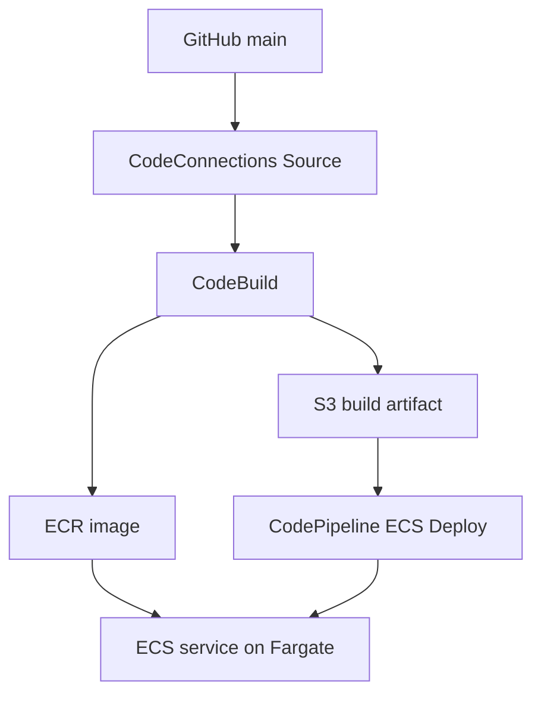

# AWS CI/CD Portfolio Website

A containerized portfolio website deployed with **GitHub, AWS CodePipeline, CodeBuild, Amazon ECR, and Amazon ECS on Fargate**.

**Author:** Marcus Griffin  
**Repository:** [Mhscb24/aws-cicd-static-website](https://github.com/Mhscb24/aws-cicd-static-website)  
**Region:** `us-east-1`

## Project overview

This project connects source changes on GitHub's `main` branch to a pipeline that builds an Nginx Docker image, publishes it to ECR, and updates an ECS service.

The live website was verified displaying **release v3.3**. A prior commit-triggered execution completed after IAM corrections and retries. Preserve the matching v3.3 execution details to document the final automatic run separately.


## Architecture



CodePipeline coordinates the workflow. CodeBuild produces both the image and the `imagedefinitions.json` artifact. The ECS deployment action consumes the artifact to update the service's task definition. S3 stores pipeline artifacts; the final website runs on ECS.

## AWS resources

| Resource | Name / configuration |
|---|---|
| Pipeline | `SimpleDockerService` |
| Source action | `CodeConnections` |
| Source branch | `main` |
| Source artifact | `SourceOutput` |
| Build stage | `Build_and_Deploy` |
| Build action | `Docker_Build_Tag_and_Push` |
| CodeBuild project | `SimpleDockerProject-0ef974d7294d` |
| Build artifact | `BuildArtifact` |
| Deploy action | `Deploy_to_ECS` |
| ECR repository | `simple-docker-service-0ef974d7294d` |
| ECS cluster | `SimpleDockerCluster` |
| ECS service | `SimpleDockerService` |
| Task definition family | `SimpleDockerTask` |
| Container | `simple-docker-container` |
| HTTP port | `80` |
| Deployment file | `imagedefinitions.json` |

Although the build stage is named `Build_and_Deploy`, deployment to ECS occurs in the separate `Deploy` stage.

## Repository files

| File | Purpose |
|---|---|
| `index.html` | Portfolio content and visible release marker |
| `Dockerfile` | Packages the website with Nginx |
| `buildspec.yml` | Repository build configuration |
| `README.md` | Project documentation |
| `docs/images/` | Documentation screenshots supplied with this README |

**Build configuration note:** The working build was adjusted using CodeBuild's inline buildspec during troubleshooting. A repository `buildspec.yml` exists, but its contents must be reconciled with the effective build configuration before treating the repository as fully reproducible.

## Deployment workflow

1. Commit a change to GitHub `main`.
2. CodeConnections provides the source artifact to CodePipeline.
3. CodeBuild authenticates to ECR, builds the image, and pushes the `latest` tag.
4. CodeBuild generates `imagedefinitions.json` and publishes it in `BuildArtifact`.
5. The ECS standard deploy action updates the service using the image mapping.
6. Verify the release text at the new running task's public IP address.

The deployment file maps the task definition's container name to an image URI:

```json
[
  {
    "name": "simple-docker-container",
    "imageUri": "<AWS_ACCOUNT_ID>.dkr.ecr.us-east-1.amazonaws.com/simple-docker-service-0ef974d7294d:latest"
  }
]
```

The build exports it with:

```yaml
artifacts:
  files:
    - imagedefinitions.json
```

## Run locally

With Docker installed and running, clone the repository and run these commands from its root:

```bash
git clone https://github.com/Mhscb24/aws-cicd-static-website.git
cd aws-cicd-static-website
docker build -t marcus-portfolio .
docker run --rm -p 8080:80 marcus-portfolio
```

Open `http://localhost:8080`. Stop the foreground container with `Ctrl+C`.

These are reproduction instructions; a fresh local run was not performed as part of preparing this README.

## Troubleshooting lessons

| Failure | Diagnosis | Resolution applied |
|---|---|---|
| `UPLOAD_ARTIFACTS` denied | CodeBuild could not write its build artifact to S3 | Added `s3:PutObject` to the CodeBuild service role for the build-artifact path |
| ECS deploy denied | Deployment role lacked ECS / pass-role permissions | Added required ECS permissions and scoped `iam:PassRole` to the task execution role |
| New GitHub connection denied | Source used a separate action role | Granted `UseConnection` for the new connection to the Source action role |

The key diagnostic command was:

```bash
aws codepipeline get-pipeline \
  --name SimpleDockerService \
  --region us-east-1 \
  --query 'pipeline.{PipelineRole:roleArn,ActionRoles:stages[].actions[].{Action:name,Role:roleArn}}' \
  --output json
```

It showed that Source and Build each had separate action roles, while the ECS Deploy action used the pipeline service role. The CodeBuild service role and ECS task execution role serve additional, different purposes.

For the new connection, the Source action role received:

```json
{
  "Version": "2012-10-17",
  "Statement": [
    {
      "Effect": "Allow",
      "Action": [
        "codeconnections:UseConnection",
        "codestar-connections:UseConnection"
      ],
      "Resource": "<GITHUB_CONNECTION_ARN>"
    }
  ]
}
```

Use your own connection ARN when adapting this example.

## Verification evidence

- Source, Build, and Deploy succeeded for the v3.2 connection-test commit after permission fixes.
- Execution details showed a Commit trigger for that run.
- The live application displayed v3.2, then v3.3 after a new source change.
- The v3.3 test commit message was `Verify automatic deployment v3.3`.
- Capture the matching successful v3.3 execution and trigger as the final evidence of an uninterrupted automatic run.


*Earlier ECS setup evidence. The v3.3 website screenshot above records the later deployed content.*

## Current scope and next improvements

This is a portfolio lab using a direct public task IP over HTTP and a mutable `latest` image tag. It does not yet include a stable load-balanced endpoint, HTTPS, automated application tests, or a documented rollback process.

Planned improvements:

- Commit-SHA image tags for traceability.
- Application Load Balancer, custom domain, and HTTPS.
- Automated checks before image publication.
- Infrastructure and IAM configuration maintained in code.
- Repository buildspec aligned with the working CodeBuild configuration.
- Monitoring, rollback validation, and a documented cleanup process.

Running tasks and other retained AWS resources can incur charges. Review the resources used by your lab and remove unused ones when finished.

## References

- [AWS ECS standard deployment tutorial](https://docs.aws.amazon.com/codepipeline/latest/userguide/ecs-cd-pipeline.html)
- [ECS deploy action and required permissions](https://docs.aws.amazon.com/codepipeline/latest/userguide/action-reference-ECS.html)
- [Image definitions file format](https://docs.aws.amazon.com/codepipeline/latest/userguide/file-reference.html)
- [CodeConnections source action permissions](https://docs.aws.amazon.com/codepipeline/latest/userguide/action-reference-CodestarConnectionSource.html)

## Skills demonstrated

Docker containerization, AWS pipeline configuration, ECR image publication, ECS/Fargate deployment, IAM role diagnosis, artifact handling, and verification of deployed content.
